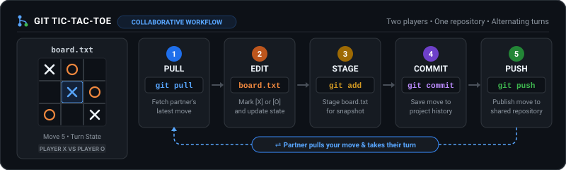

# Git Tic-Tac-Toe Workshop



A two-hour, beginner-friendly Git and GitHub workshop where pairs play tic-tac-toe by making small commits to a shared repository. The aim is for both learners to publish a move and receive their partner's move with `git pull`.

## Workshop Documents & Guides

```text
.
├── .github/                  # GitHub Issue templates and CI workflows
├── docs/                     # Game Wall web application and browser guides
├── scripts/                  # Board validation and simulation utilities
├── template-spec/            # Specification and tests for board.txt format
├── tests/                    # Automated Python unit and integration test suite
├── CONTEXT.md                # Canonical domain glossary and terminology
├── FACILITATOR_GUIDE.md      # Facilitator walkthrough, live demo script & recovery
├── LEARNER_GUIDE.md          # In-session player roles and 5-step turn workflow
├── PRE_SESSION_CHECK.md      # Pre-workshop Git & GitHub setup instructions
├── README.md                 # Workshop overview, agenda, and quick reference
└── REHEARSAL_GUIDE.md        # Facilitator rehearsal protocol and readiness checks
```

**Quick Links:**
- **[Facilitator Guide](FACILITATOR_GUIDE.md)**: Facilitator walkthrough, live demo script, and error recovery.
- **[Rehearsal & Readiness Guide](REHEARSAL_GUIDE.md)**: Rehearsal protocol, timing guarantees, and OS readiness matrix.
- **[Learner Guide](LEARNER_GUIDE.md)** ([Web](docs/guide.html)): In-session player roles (Player X / Player O) and 5-step turn workflow.
- **[Pre-Session Setup Guide](PRE_SESSION_CHECK.md)** ([Web](docs/setup.html)): Git installation, GitHub account configuration, and auth options.
- **[Learner Starter Template](https://github.com/igorsdub/git-tic-tac-toe-template)**: Template repository used by pairs to instantiate games.
- **[Game Wall](docs/index.html)**: Live interactive workshop dashboard visualising pair repositories.
- **[Terminology & Glossary](CONTEXT.md)**: Canonical domain glossary and standard workshop concepts.

## Workshop Structure at a Glance

| Time | Phase | Focus |
|---|---|---|
| **00:00 – 00:15** | **Arrival, Opening Question & Experience Pairing** | Poll Git experience, pair beginners with experienced partners as Player X / Player O. |
| **00:15 – 00:25** | **Presentation** | Mental model: local vs remote, staging, commits. |
| **00:25 – 00:40** | **Live Demonstration** | Facilitator and co-player demonstrate Moves 1 & 2 live. |
| **00:40 – 01:25** | **Paired Gameplay & Branch Rematch** | Hands-on 9-turn game; optional branch rematch. |
| **01:25 – 01:40** | **Research Transfer & `git log` Discussion** | Inspect Game Wall, commit history review. |
| **01:40 – 02:00** | **Buffer Time & Troubleshooting Catch-Up** | Flexible cushion for auth/merge recovery. |

## Game Wall & Pair Registration

The workshop features a shared public [Game Wall](docs/index.html) designed for GitHub Pages that visualizes all active and completed pair games in real time.

- **Register a Game**: Pairs register their repository URL and handles using the [Pair Game Registration Form](.github/ISSUE_TEMPLATE/register-game.yml).
- **Live Board Tracking**: The Game Wall queries issues labeled `game-registration`, fetches raw `board.txt` files from learners' repositories, validates canonical state and turn parity, and renders responsive cards with player avatars and visual 3x3 boards.
- **Facilitator Projection**: Features a high-contrast monochrome design optimized for classroom projectors and displays, dark/light theme toggle, simplified filter tabs (All, Pending, Finished), and auto-refreshes every 30 seconds without full-page reloads.
- **Load Simulation & Rate Limits**: See [Game Wall Scalability & Load Simulation](docs/load_test_simulation.md) for rate-limit budget calculations (60 unauthenticated requests/hr) and performance verification under 10–20 concurrent pair repositories.

## Learner Template & Board Format

The paired game activity relies on the public GitHub template repository [igorsdub/git-tic-tac-toe-template](https://github.com/igorsdub/git-tic-tac-toe-template).

- **Starter Repository**: Pairs click **Use this template** to spawn their game repository with no manual board setup required.
- **Board File (`board.txt`)**: A structured representation of the 3x3 grid with Player X/O handles and state indicators (`Ready for X`, `Waiting for O`, `Waiting for X`, `X won`, `O won`, `Draw`).
- **Validation**: Run `python3 scripts/validate_board.py <path/to/board.txt>` to verify file structure, check turn parity, and evaluate the game state. See [template-spec/](template-spec/) for full specifications and test samples.

The workshop design and implementation tasks are tracked in GitHub issues.
